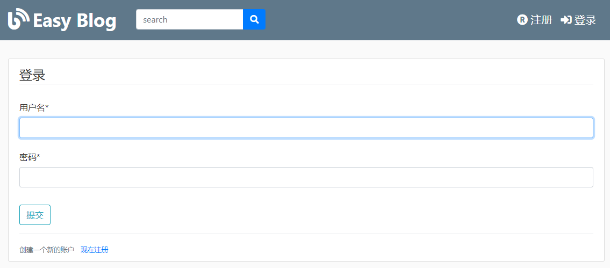
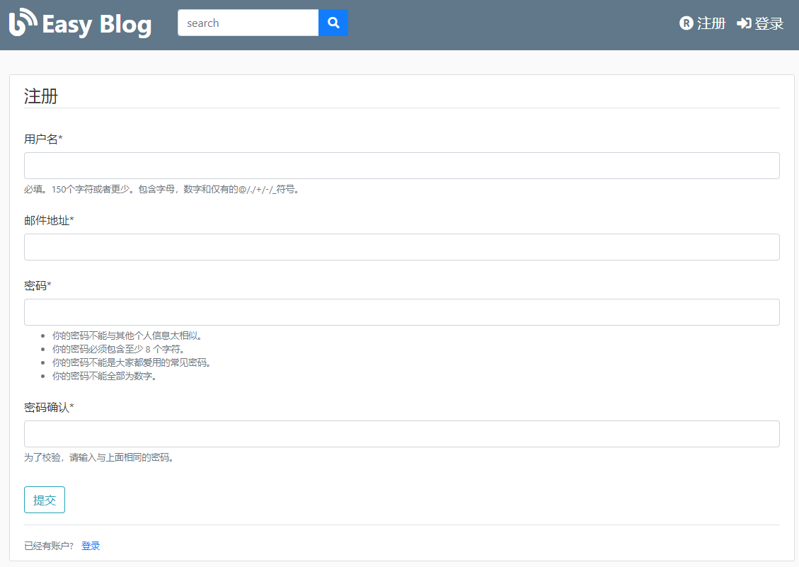
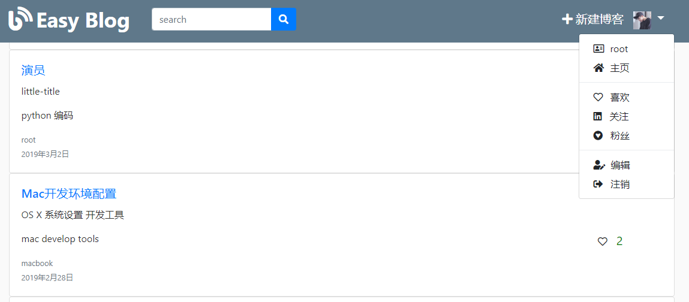
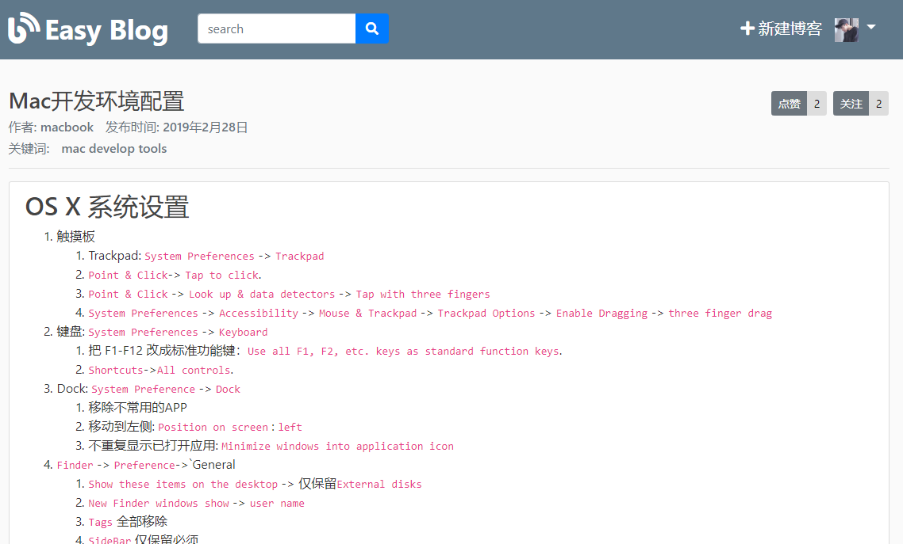
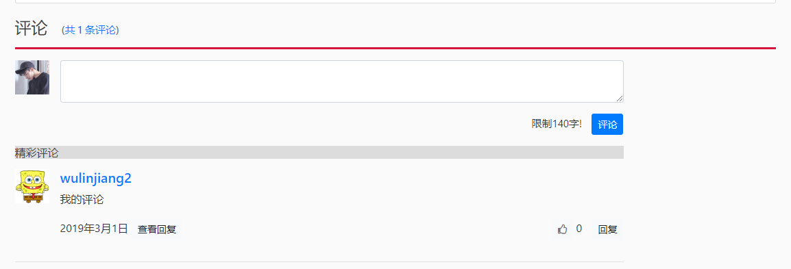
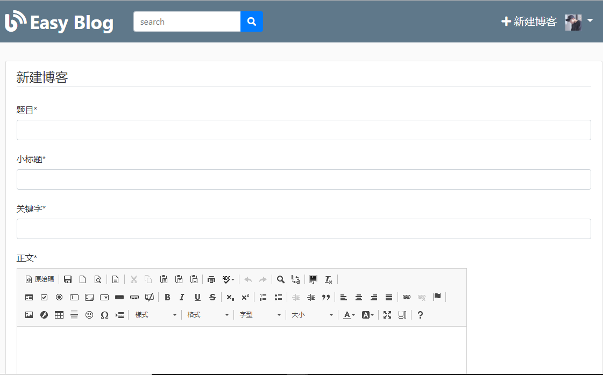
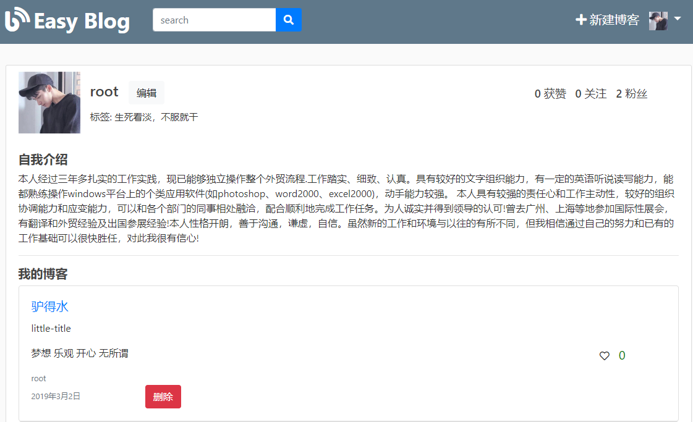
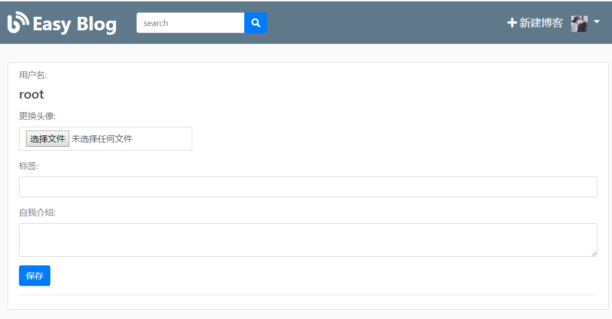
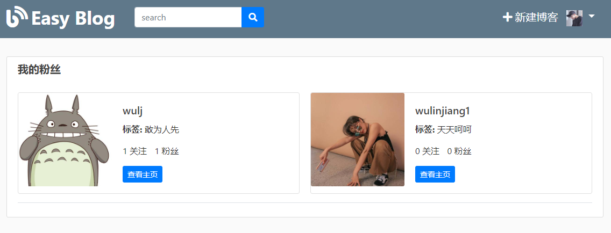

## easyBlog
在线blog分享网站

### 功能
- 用户登陆,注册,查看,编辑个人主页
- 更加方便的创建博客，支持上传图片，提供很多便捷的toolbar
- 查看,点赞博客，关注博主,查看博主主页
- 删除个人博客,评论博客，回复,点赞评论
- 采用docker轻松部署项目

### 依赖
    python3.7
    django2.1
    bootstrap4
    jquery,font-awesome
    django-ckeditor
    docker
    
### git安装部署
    git clone https://github.com/wuljchange/easyBlog.git
    pip3 install -r requirements.txt
    python3 manage.py runserver 0.0.0.0:80
    
### docker部署
    docker login
    docker run -d -p 80:80 wuljchange/easyblog:v1.0.0
    
### 效果图
- 登录

- 注册

- 主页

- blog详细展示

- blog评论

- 创建blog

- 个人资料

- 编辑个人资料

- 个人粉丝

### 优化
- 每次评论后，不要重新加载页面，给用户更人性化的体验
- 增加对个人已发布博客进行修改，编辑
- 增加对用户上传博客，提交评论的不良信息鉴别
- 增加后台用户管理

### 反馈
- wuljfly@icloud.com
- 1473236447@qq.com